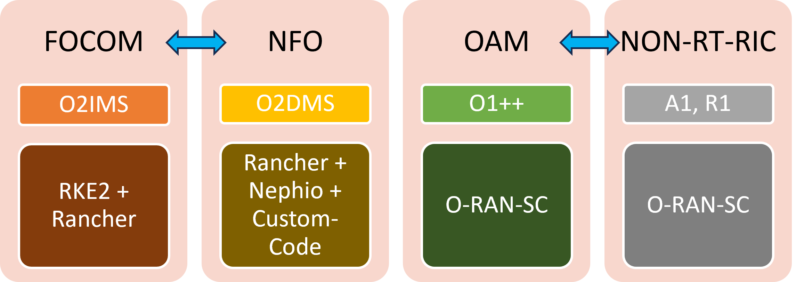
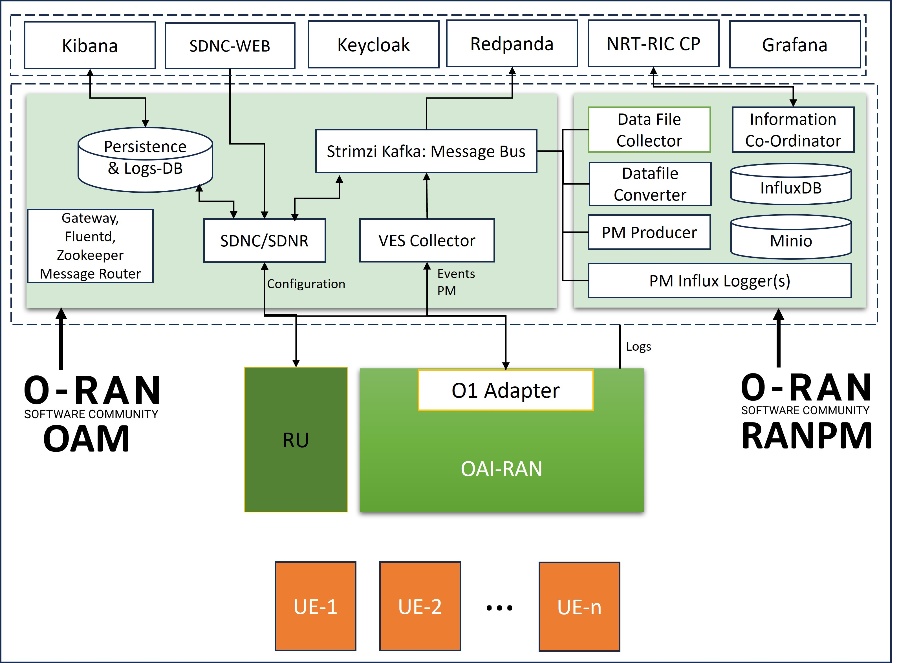

. This work is licensed under a Creative Commons Attribution 4.0 International License.
.. SPDX-License-Identifier: CC-BY-4.0

IOS-MCN User-Experience
=======================

This document describes the experience of IOSMCN project in using O-RAN-SC solutions.

About IOSMCN
------------
The Indian Open-Source Software Platform for end-to-end Mobile Communication Networks (IOS-MCN) will accelerate the development and deployment of Mobile Communication (5G/6G) products and services by the vendors.

It is a collaboration between academia, government, and the Indian Telecom Ecosystem (vendors, service providers, companies, and startups) to leverage the global open-source ecosystem and establish a common forum for open source technology projects and solutions from India, by India.

The IOS-MCN Consortium provides a neutral, democratic, and trusted platform for the translation of 5G/6G innovation and research into commercially deployable Open Source software.

About the Work
--------------
The work is about adding SMO solution for IOS-MCN based on open-sources. The below figure shows the scope of the work. SMO of IOSMCN provides the following:

- Automated deployment of Kubernetes Cluster and Docker Environment
- Automated Deployment of RAN, Core and OAM Components.
- Configuration of RAN and Core through GUI.
- Visualization of Performance metrics, Faults and Logs.

The first release of IOS-MCN mostly cover the OAM component of the SMO.

The OAM Architecture
--------------------

The overall OAM architecture of IOS-MCN is shown below.

Experience
----------
We will describe the experience - in terms of lessons learnt, challenges faced, choosing right solution among the available alternatives, etc, - for each of the individual components one by one.

SDN-Controller based configuration of RAN
~~~~~~~~~~~~~~~~~~~~~~~~~~~~~~~~~~~~~~~~~
The project initially explored the light-weight configuration solution for RAN. Developing a custom Netconf client application is not a challenge, However, features such as additional features such as message-handling, topology management, and inventory, which are already part of an SDN controller, makes a strong case for SDN-Controller based solution. In addition, all available open-source RAN configuration solutions are SDN-based (we couldn't find what solution srsRAN is using). 

Alternatives:
#############
1. ONAP's SDNC and SDNC-Web - part of O-RAN-SC's OAM.
2. ONOS-Config 
3. OpenMPlane (For RU configuration).

ONOS-Config is based on gNMI, and lacked Netconf Support. Converting from gNMI to Netconf adds additional work. Hence we decided to use SDNC/R (ODL) from o-ran-sc/oam.

We will be exploring OpenMplane for the next release of IOS-MCN.

Design Decisions
################

1. Use persistency of not, and if yes, which one?. We decided to use persistency and stick with Elasticsearch, at least for the first release. The community has moved to MongoDB, due to uncertainties over Elastic remaining opensource, and we may eventually make the move to MongoDB.
2. We decided to reuse the elasticsearch database for our logging needs. The same persistency database of SDNC is used for logging in IOSMCN.

Challenges:
###########

1. Currently, the SDNC-Web's configuration application has lot of issues in processing the configuration (get configuration) and also while making the actual changes to the configurable parameters. This is the only drawback, and a major one, of the O-RAN-SC's OAM solution. Unless this issue is fixed or an alternative solution is created, the OAM solution will not find many takers.
2. Picking the right versions of Elasticserach and Kibana, which will also work with Fluentd is not so straightforward.
3. Controller, for the first time may fail to start within the timeout period - mainly due to interactions with the elastic search. We ended up restarting the container most of the times. The most recent version that we could get it working is 7.17.24.

Tips:
#####

1. Ensure you are subscribing for right messages (Kafka topics) using 'topic' parameters - refer to configuration in `Mountpoint Properties <https://github.com/o-ran-sc/oam/blob/master/solution/smo/oam/controller/mountpoint-registrar.properties>`_

2. In the same file, ensure your kafka deployment name is correct under "bootstrapServers" parameter.
3. Important environment variables:

    i. SDNR_VES_COLLECTOR_IP and PORT.
    ii. SDNR_VES_COLLECTOR_USERNAME and PASSWORD
    iii. SDNRDBURL
4. If you have to build sdnc and sdnc-web images, use the `sdnc-oam repo <https://github.com/onap/sdnc-oam>`_

VES-Collector
~~~~~~~~~~~~~

VES collector is a needless critical components. 

Alternatives:
#############
1. VES-Collector from ONAP - which is used by the O-RAN-SC's OAM project.
2. VES-Collector from the O-RAN-SC's SMO project.

The VES-Collector from smo-ves is not actively maintained. Hence, we decided to use the VES-Collector from ONAP, which is part of O-RAN-SC's OAM project.

Design Decisions
################

1. Do we even need VES collector? Without the VES collector, the burden of mapping message to topics has to be done borne by somebody else - probably the O1-adapter. Hence, we do need VES collector.
2. Do we need validation by VES collector? This we MAY not need and just a component that maps messages to topics should be enough. We will be experimenting by creating a simple HTTP server-cum-client, which receives messages from RAN components, parses the header, and calls Kafka-bridge's APIs.

Challenges:
###########

1. Upgrading to newer version is a challenge - it doesn't work. The newer version of ves-collect (1.12.5) does not work. The most recent version we can use is 1.12.4.

Tips:
#####

1. DMAAP_HOST
2. 

Message Router
~~~~~~~~~~~~~~

Alternatives:
#############
1. DMAAP-MR (not actively developed)
2. Kafka Bridge.

As we could not complete the testing of kafka bridge with VES-Collector, at least for the first release, we are sticking with the deprecated DMAAP-MR. Even O-RAN-SC OAM is using the dmaap-mr as the messge router. We will eventually migrate to kafka-bridge.

Design Decisions
################
None

Challenges:
###########

1. 

Tips:
#####

1. 

Handling File-Ready
~~~~~~~~~~~~~~~~~~~

Alternatives:
#############

Design Decisions
################

Challenges:
###########

1. Upgrading to newer version is a challenge - it doesn't work.

Tips:
#####

Component
~~~~~~~~~

Alternatives:
#############

Design Decisions
################

Challenges:
###########

1. Upgrading to newer version is a challenge - it doesn't work.

Tips:
#####

User Contact for IOS-MCN
************************
Name: Sridhar K. N. Rao
email: sridharkn@u.nus.edu

